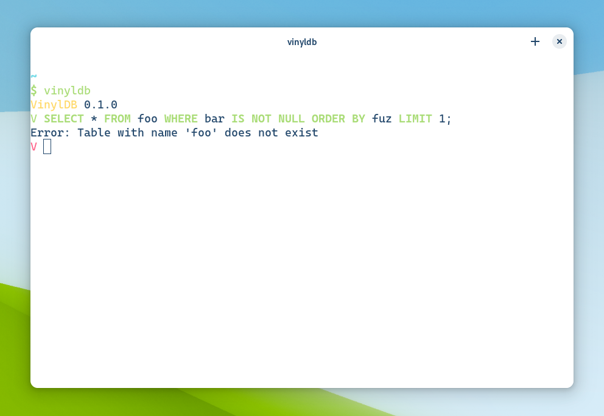

## reedline_sql_highlighter

A SQL keyword highlighter for [`reedline`](https://crates.io/crates/reedline).

### Compatibility

It uses `reedline` 0.30.x;

### Performance

The implementation is quite in-efficient, it tokenizes the (the **whole**) input string and 
highlights the keywords, on every input buffer change.

